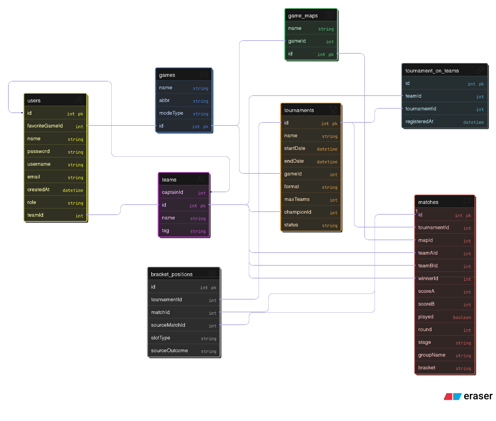

# 🏆 eSports Tournament Hub API v1

## 🏷️ Identificação / Autor
- **Nome Completo do Aluno:** Raul Ferreira da Rocha
- **Disciplina:** Tópicos Especiais em Programação  
- **Tema do Projeto:** Gerenciamento de Campeonatos de eSports (Single/Double Elimination, RoundRobin, Group Stage and Playoffs)
- **Link do Projeto no GitHub:** https://github.com/raulfrocha/esports-tournament-hub

---

## 📑 Descrição do Projeto
A **eSports Tournament Hub API** é um sistema backend desenvolvido com **NestJS** e **Prisma ORM** para automatizar o gerenciamento de torneios de eSports.  
A API oferece funcionalidades completas de CRUD e regras de negócio avançadas, com foco em segurança (**JWT/Guards**) e integridade dos chaveamentos.

---

## 🔑 Funcionalidades Chave
- **Gerenciamento de Chaveamento:**  
  Suporte para Mata-Mata Simples e com Dupla Eliminaçãp, Pontos Corridos e Fase de Grupos, com avanço automático após registro dos resultados.

- **Autorização Granular:**  
  Controle de acesso por **Roles (ADMIN/PLAYER)** e por recurso (CaptainGuard, OwnerGuard).

- **Status de Torneio:**  
  Uso de `TournamentStatus` para impedir múltiplas inicializações.

---

## 🌐 Acesso à API
- **URL Base:**  
  ``

- **Swagger (Documentação Interativa):**  
  ``

---

## ⚙️ Instruções de Execução Local

### Pré-requisitos
| Ferramenta | Versão Mínima |
|-----------|----------------|
| Node.js   | v18.x ou superior |
| npm/Yarn  | Mais recente |
| Prisma CLI | 6.x ou superior |
| Banco de Dados | MySQL ou PostgreSQL |

---

### Instalação

```bash
git clone https://github.com/raulfrocha/esports-tournament-hub
cd esports-tournament-hub
```

```bash
npm install
# ou
yarn install
```

### Configuração do Banco (ID9, ID10)

Crie um arquivo `.env` com a URL do banco e execute:

```bash
npx prisma migrate dev --name init_tournament_schema
```

### Variáveis de Ambiente (ID17)

```ini
# .env.example
PORT=3000
DATABASE_URL="[SUA URL DE CONEXÃO]"
JWT_SECRET="sua_chave_secreta_para_jwt"
```

### Execução

```bash
npm run start:dev
# API em http://localhost:3000
```

---

## 🗃️ Estrutura e Modelagem de Dados

### Diagrama ER (ID8)



---

# ✅ Checklist de Funcionalidades e Indicadores de Desempenho

### RAID – Indicador de Desempenho

#### RA1
- [X] **ID1** Arquitetura modular (NestJS Modules, Controllers, Services)  
- [X] **ID2** Separação da lógica de negócios  
- [X] **ID3** Injeção de dependência via Providers  
- [X] **ID4** Rotas HTTP configuradas corretamente  
- [X] **ID5** Filtros globais para erros  
- [X] **ID6** DTOs implementados
- [X] **ID7** ValidationPipe + class-validator  

#### RA2
- [X] **ID8** Modelagem refletida no ERD
- [X] **ID9** Conexão com BD relacional via Prisma
- [X] **ID10** Migrações do Banco
- [X] **ID11** CRUD implementado

#### RA4
- [X] **ID14** Swagger completo
- [X] **ID15** Deploy na nuvem
- [X] **ID16** API funcional em produção
- [X] **ID17** Variáveis de ambiente configuradas
- [X] **ID18** Versionamento de API REST

#### RA5
- [X] **ID19** Autenticação JWT
- [X] **ID20** Guards de acesso (Roles, Captain, Owner)
- [X] **ID21** Middleware global
- [X] **ID22** Interceptadores com padronização e métricas
